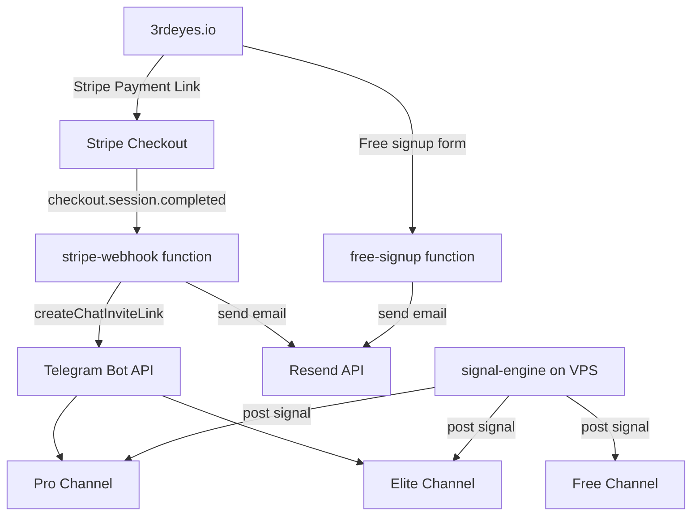

# 3rd Eyes — AI Weather Signal Platform

[](https://app.netlify.com/projects/teal-smakager-9bcd8c/deploys)


> Automated AI weather arbitrage signals delivered to subscribers via Telegram. Built on a fully serverless stack — zero infrastructure to manage.

**Live:** [3rdeyes.io](https://3rdeyes.io)

---

## What It Does

3rd Eyes monitors temperature prediction markets on [Kalshi](https://kalshi.com) and delivers high-confidence trade signals to subscribers before the market moves. Signals are generated by a GFS ensemble model pipeline (see [`signal-engine`](https://github.com/3rdeyes-io/signal-engine)) and pushed to private Telegram channels based on subscription tier.

```
Subscriber pays → Stripe → Webhook → Telegram invite generated → Email delivered
Signal fires    → Engine → Telegram channel (Pro/Elite/Free)
```

---

## Architecture



---

## Tech Stack

| Layer | Technology |
|---|---|
| Hosting | Netlify (CDN + serverless functions) |
| Payments | Stripe (Payment Links + Webhooks) |
| Email | Resend |
| Delivery | Telegram Bot API |
| Signal Engine | Python 3.11, GFS ensemble API, Kalshi API |
| Domain | 3rdeyes.io |

---

## Repository Structure

```
├── index.html              # Marketing site
├── success.html            # Post-payment confirmation page
├── methodology.html        # Signal methodology explainer
├── track.html              # Public performance tracker
├── sizing.html             # Position sizing guide
├── logo.svg
├── netlify.toml            # Build + redirect config
├── robots.txt
├── sitemap.xml
└── netlify/
    └── functions/
        ├── stripe-webhook.js   # Handles Stripe checkout.session.completed
        ├── free-signup.js      # Handles free tier email signups
        └── stats.js            # Public performance stats endpoint
```

---

## Subscription Flow

### Paid (Pro / Elite)
1. User clicks a Stripe Payment Link on the site
2. Stripe fires `checkout.session.completed` to `/.netlify/functions/stripe-webhook`
3. Webhook verifies signature, identifies plan from `line_items`
4. Creates a **one-time, 7-day** Telegram invite link via Bot API
5. Sends welcome email via Resend with the invite link

### Free
1. User submits email on homepage
2. `free-signup` function sends a welcome email with the public channel link

---

## Environment Variables

Set these in Netlify → Site settings → Environment variables (never commit them):

| Variable | Description |
|---|---|
| `STRIPE_SECRET_KEY` | Stripe live secret key |
| `STRIPE_WEBHOOK_SECRET` | Stripe webhook signing secret |
| `STRIPE_PRO_PRICE_ID` | Stripe Price ID for Pro plan |
| `STRIPE_ELITE_PRICE_ID` | Stripe Price ID for Elite plan |
| `TELEGRAM_BOT_TOKEN` | Bot token from @BotFather |
| `TELEGRAM_PRO_CHANNEL_ID` | Numeric ID of private Pro channel |
| `TELEGRAM_ELITE_CHANNEL_ID` | Numeric ID of private Elite channel |
| `TELEGRAM_FREE_CHANNEL_ID` | Numeric ID of public free channel |
| `TELEGRAM_ADMIN_CHAT_ID` | Personal chat ID for admin logging |
| `RESEND_API_KEY` | Resend API key for transactional email |

See [`.env.example`](.env.example) for the full template.

---

## Local Development

```bash
# Install Netlify CLI
npm install -g netlify-cli

# Install function dependencies
cd netlify/functions && npm install

# Run locally (functions + site)
netlify dev
```

---

## Deployment

Deployments are triggered automatically on push to `main` via GitHub Actions (see [`.github/workflows/deploy.yml`](.github/workflows/deploy.yml)).

Manual deploy:
```bash
netlify deploy --prod
```

---

## Related

- **[signal-engine](https://github.com/3rdeyes-io/signal-engine)** — The AI signal generation engine running on VPS
